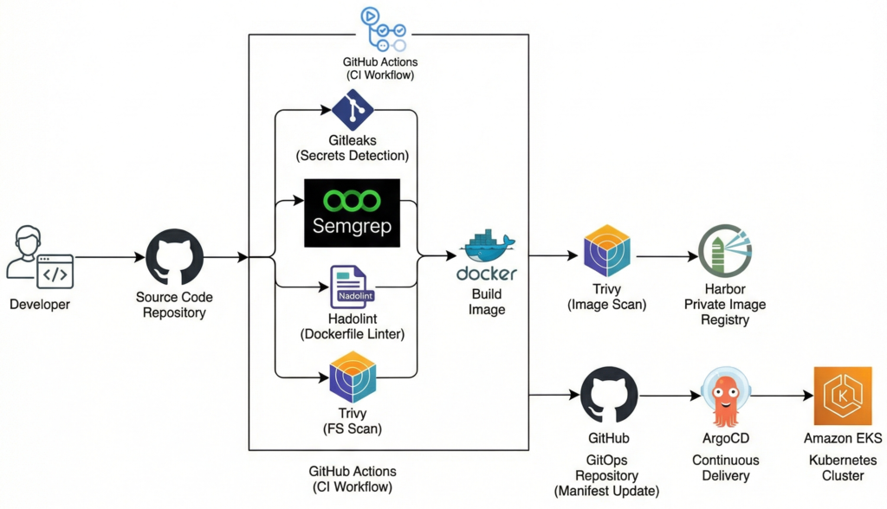

# Projeto Iac + DevOPS + AWS

Este projeto utiliza:

- Kubernetes (EKS)
- Terraform deploy da infra na AWS
- Harbor para registry de imagens docker
- ArgoCD para gitops
- Github Actions para pipeline
- Trivy pata SCA e Container Security
- Semgrep para SAST
- Hadolint para boas praticas, linter e problemas de segurança.
- Gitleaks para verificação de senhas expostas

---

# Explicação do Projeto

### A ideia do projeto é apresentar o deploy de uma aplicação na infra kubernetes da AWS.  
1. Desenvolvedor e Repositório de Código: O processo começa com um desenvolvedor enviando código para um repositório no GitHub.

2. GitHub Actions (Workflow de CI): O envio do código aciona um fluxo de trabalho de Integração Contínua (CI) no GitHub Actions. Este fluxo executa quatro verificações de segurança e qualidade em paralelo:

    - Gitleaks: Detecta segredos (como chaves de API ou senhas) que podem ter sido incluídos acidentalmente no código.

    - Semgrep (SAST): Realiza testes estáticos de segurança de aplicação para encontrar vulnerabilidades no código-fonte.

    - Hadolint: Verifica o arquivo Dockerfile em busca de violações de boas práticas.

    - Trivy (FS Scan): Escaneia o sistema de arquivos em busca de vulnerabilidades.

3. Construção e Escaneamento da Imagem: Após as verificações, uma imagem Docker é construída. Em seguida, o Trivy realiza um novo escaneamento, desta vez na imagem construída, para garantir que ela esteja segura.

4. Registro de Imagem Privado: A imagem segura é enviada para um registro privado, o Harbor.

5. Repositório GitOps: Paralelamente, o fluxo de trabalho atualiza um repositório separado no GitHub dedicado ao GitOps com o manifesto da nova imagem.

6. Entrega Contínua (CD): O ArgoCD, uma ferramenta de entrega contínua, monitora o repositório GitOps. Ao detectar a atualização do manifesto, ele sincroniza o estado desejado.

7. Cluster Kubernetes: Finalmente, o ArgoCD implanta a aplicação atualizada no cluster Amazon EKS (Elastic Kubernetes Service).

---
#### A ideia de melhoria do projeto é aplicar Checkov + OPA (open policy agent) no código de setup da infra, ou seja, nesse repo, e trabalhar com branchs diferentes.
---

Repositório da aplicação deployada no EKS:  
https://github.com/fabriciocdn/simple_app

Repositório GitOps onde fica os manifestos helm de infra da aplicação. 
https://github.com/fabriciocdn/git_ops

Repositório da infra aws: 
https://github.com/fabriciocdn/infra_code

Módulo usado fazer o setup do EKS com Grupos de nós gerenciados, esse módulo eu desenvolvi.
https://github.com/fabriciocdn/terraform_aws_eks

---

### Diagrama da Arquitetura da infra na AWS

### Documentação da Infraestrutura - AWS DevOps Project
Esta infraestrutura foi desenhada para suportar um ecossistema de Integração Contínua e Entrega Contínua (CI/CD), integrando serviços geridos da AWS com ferramentas de código aberto para segurança e GitOps.

### 1. Arquitetura AWS
#### A infraestrutura é composta pelos seguintes componentes principais:

- VPC (Virtual Private Cloud): Rede virtual configurada com blocos CIDR específicos, dividida em sub-redes públicas e privadas para isolamento de recursos.

- Amazon EKS (Elastic Kubernetes Service): Cluster Kubernetes gerido que serve como base para todas as aplicações.

- Managed Node Groups: Grupos de instâncias EC2 geridos pelo EKS para execução de pods.

- AWS Load Balancer Controller: Controlador para gestão automática de Application Load Balancers (ALB).

- Amazon S3: Utilizado para armazenamento persistente de imagens no registry Harbor e para o backend do estado do Terraform.

- IAM (Identity and Access Management): Políticas e funções (Roles) para garantir acesso seguro entre o cluster Kubernetes e os buckets S3.

### 2. Estrutura do Terraform
#### Provedores e Backend
#### O projeto utiliza múltiplos provedores para interagir com diferentes APIs:

- AWS: Para gestão de recursos de nuvem.

- Kubernetes & Helm: Para gerir recursos dentro do cluster EKS após o seu aprovisionamento.

- Random & TLS: Para geração de sufixos únicos e certificados.

- O estado do Terraform (tfstate) é armazenado de forma remota num bucket S3 (s3-devops-lab) na região us-east-1 para permitir a colaboração e segurança do estado da infraestrutura.

- Módulos Utilizados
- A configuração baseia-se em módulos personalizados para promover a reutilização:

- Módulo de Rede: Criação da VPC e sub-redes.

- Módulo de Cluster: Configuração do control plane do EKS.

- Módulo de Node Group: Configuração dos nós de computação.

- Módulo Load Balancer: Instalação do controlador de entrada da AWS.

### 3. Segurança e Armazenamento do Harbor
#### Para o funcionamento do Harbor (Registry de imagens), a infraestrutura provisiona:

- Bucket S3: Um bucket dedicado com sufixo aleatório para garantir unicidade.

- IAM Policy: A política HarborS3StoragePolicy permite ações como s3:ListBucket, s3:PutObject e s3:DeleteObject apenas no bucket do registry.

- IAM Role com OIDC: Utiliza o provedor OIDC do cluster EKS para permitir que o Service Account do Harbor assuma a função IAM sem necessidade de chaves fixas (IAM Roles for Service Accounts - IRSA).

### 4. Gestão de Aplicações (Helm)
#### A instalação de software no cluster é orquestrada via helmfile.yaml, que define as seguintes releases:

- Harbor: Registry privado configurado para utilizar o armazenamento S3 da AWS.

- ArgoCD: Ferramenta de GitOps para automatizar a sincronização de manifestos Kubernetes.