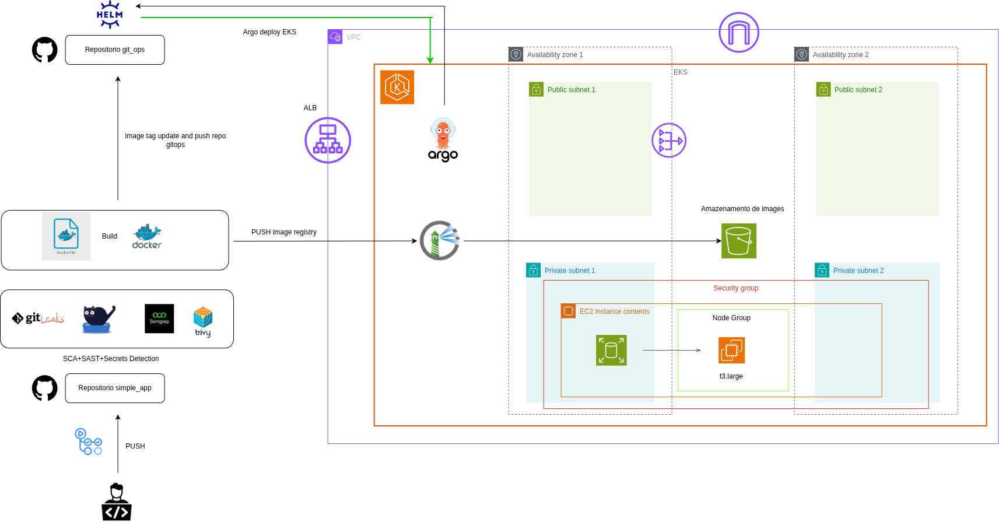

# Projeto Iac + DevOPS + AWS

Este projeto utiliza:

- Kubernetes (EKS)
- Terraform deploy da infra na AWS
- Harbor para registry de imagens docker
- ArgoCD para gitops
- Github Actions para pipeline
- Trivy pata SCA e Container Security
- Semgrep para SAST
- Hadolint para boas praticas, linter e problemas de segurança.
- Gitleaks para verificação de senhas expostas
---
Repositório da aplicação deployada no EKS:  
https://github.com/fabriciocdn/simple_app

Repositório GitOps onde fica os manifestos helm de infra da aplicação. 
https://github.com/fabriciocdn/git_ops

Repositório da infra aws: 
https://github.com/fabriciocdn/infra_code

Módulo usado fazer o setup do EKS com Grupos de nós gerenciados, esse módulo eu desenvolvi.
https://github.com/fabriciocdn/terraform_aws_eks

---

### Diagrama de Arquitetura

---

# Explicação do Projeto

### A ideia do projeto é apresentar o deploy de uma aplicação na infra kubernetes da AWS.  
1 - O desenvolvedor faz alteração no código da aplicação e faz o push.  
2 - Ao fazer o push, o código da aplicação e o Dockerfile passa por uma esteira de Scans de vulnerabilidade.  
3 - Ao passar pelos jobs acima, é feito o Build e um scan da imagem e um push para o Harbor, o registry de imagens docker privado, que está instalado no EKS.  
